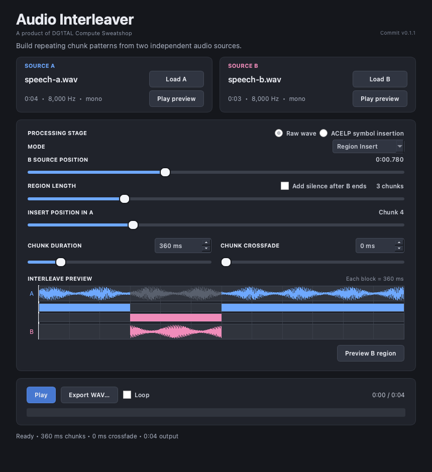

# Audio Interleaver

Audio Interleaver is a desktop tool for replacing chunks of source A with
chunks from source B. It accepts mono or stereo WAV files and exports 16-bit
PCM WAV audio.

Two processing stages are available:

- **Raw wave** replaces PCM samples.
- **ACELP symbol insertion** encodes A as a continuous stream, replaces selected
  137-bit vocoder frames with independently encoded B frames, then decodes the
  mixed stream continuously. It does not simulate TETRA channel coding or radio
  interleaving.

## Interface

The default Region Insert workflow selects a continuous section of source B
and places it into a chunk-aligned window on the source-A timeline.



## Interleave modes

**Region Insert** is the default mode. It replaces a chunk-aligned window of A
with a continuous region from B. **Insert position in A** and **Region length**
set the replacement window in whole chunks. **B source position** independently
sets where the inserted audio begins within B: Raw mode moves in 1 ms steps,
while ACELP mode moves in 30 ms codec-frame steps. This finer source position
does not change the chunk boundaries of the output window.

Enable **Add silence after B ends** to extend the selected window beyond the
end of B. The remaining part of the inserted region contains silence instead
of wrapped B audio.

**Pattern Interleave** creates a repeating A/B pattern. Controls select the
starting source, first alternate-source chunk, B burst size, and number of
active B occurrences. Source A stays fixed on the output timeline; selected B
chunks advance in order.

The timeline shows both source waveforms, selected chunks, and playback
position. **Preview B region** plays the current Region Insert selection.

## Audio behavior

Raw chunk duration ranges from 50 to 2,000 ms. An optional 0–50 ms equal-power
crossfade is applied when the selected source changes. In Pattern Interleave,
short sources loop by whole chunks. Partial final chunks and Region Insert
windows extending beyond available B audio are padded with silence.

ACELP audio is mono at 8 kHz and uses 30 ms frames. Chunk durations therefore
range from 30 to 1,980 ms in 30 ms steps. Typed values snap to the nearest legal
duration. Crossfading is disabled.

ACELP symbol insertion follows the pipeline shown in the application:

1. Encode the complete source-A timeline as one continuous symbol stream.
2. Encode only the active source-B chunks with an independent B encoder.
3. Replace the selected A frames with the resulting B frames. This does not
   change the output duration.
4. Decode the complete mixed symbol stream continuously in one pass.

The **B symbol encoding** setting controls only the independent B encoder:

- **Continuous selected B chunks** preserves independent B encoder state across
  active chunks. It does not inherit A encoder state.
- **Restart each B chunk** starts every active B chunk with fresh encoder state.

For an extended Region Insert, zero PCM is encoded for the silent B tail using
the selected B mode. Because decoding is continuous, inserted B frames use the
decoder state established by preceding output frames. When the stream returns
to A, its original A symbols are decoded using state affected by B. These state
mismatches are part of the simulated insertion effect.

**Export WAV…** writes the rendered result. In ACELP mode, **Export ACELP
symbols…** also writes an ETSI simulation-format `.spe` file. Each 30 ms frame
contains 138 little-endian 16-bit words: one bad-frame indicator followed by
137 bit values.

## Requirements

- Python 3.12 or newer
- A supported C compiler
- An audio output device
- WAV input files

Linux users may need Qt, PortAudio, and libsndfile packages. On Debian/Ubuntu:

```bash
sudo apt update
sudo apt install python3-venv libportaudio2 libsndfile1 libegl1
```

## Install

Create the repository-local virtual environment on macOS or Linux:

```bash
python3 -m venv .venv
source .venv/bin/activate
python -m pip install -e ".[dev]"
```

On Windows PowerShell:

```powershell
py -m venv .venv
.venv\Scripts\Activate.ps1
python -m pip install -e ".[dev]"
```

Use `python -m pip install -e .` to omit test dependencies. Installation also
builds the native TETRA ACELP extension.

## Run

```bash
python -m audio_interleaver
```

Load both sources, choose a processing stage, and configure the default Region
Insert window. Switch to Pattern Interleave when a repeating replacement
pattern is needed. Then play or export the result. Source preview buttons play
the original WAV files. ACELP settings are locked while a result is being
prepared or played.

The window displays the current Git commit. Packaged builds can set it with the
`AUDIO_INTERLEAVER_COMMIT` environment variable.

## Diagnostics

The application keeps rotating playback and crash diagnostics so failures in
PortAudio, CoreAudio, Qt, or a native extension can be investigated even when
no error dialog appears. On macOS, the files are stored in
`~/Library/Logs/Audio Interleaver/`; on Linux, they default to
`~/.local/state/audio-interleaver/`; and on Windows they are stored below
`%LOCALAPPDATA%\Audio Interleaver\Logs`. Set `AUDIO_INTERLEAVER_LOG_DIR` to use
a different directory.

`audio-interleaver.log` records playback sessions, loop transitions, stream
lifecycle events, device information, and Python exceptions.
`native-crash.log` receives Python fault-handler output for fatal native
signals. If playback fails, preserve both files along with the matching
operating-system crash report.

## Test

```bash
python -m pytest
```

GitHub Actions runs the suite on macOS, Windows, and Linux. Codec source and
provenance are documented in `vendor/tetra_codec/README.md`; redistribution is
subject to the applicable ETSI terms.

## License

Original Audio Interleaver code and documentation are licensed under the MIT
License. The ETSI-derived codec files under `vendor/tetra_codec/source/` and
`vendor/tetra_codec/include/` are third-party material and are not covered by
the MIT License. The combined repository and distributions should therefore
not be described simply as MIT-licensed. See `LICENSE` and
`THIRD_PARTY_NOTICES.md` for the precise scope, provenance, warranty, and patent
notices.
